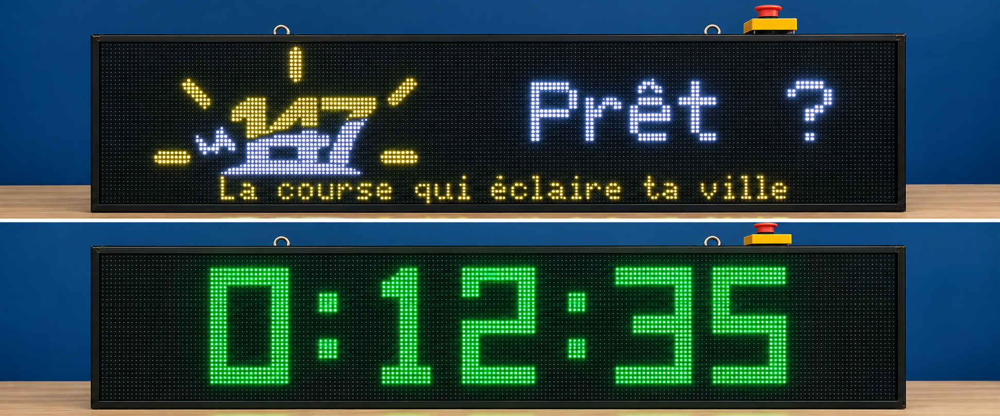

# La 147 LED Race Timer

## Context

For [La 147](https://la147.run), a 10 km night running event, I wanted to build a large race timer mounted on the bike opening the race.

The main goal is to have a timer large enough to be visible by the runners behind the bike.

The display is made of 6 HUB75 LED panels arranged in a 3 x 2 layout, creating a virtual **192 x 64 pixels** display.

The project is based on an **Adafruit MatrixPortal S3**.




## Features

The timer displays time using a large 7-segment style display:

`H:MM:SS`

Three states are available:

- **READY**: displays the La 147 logo and welcome message
- **RUNNING**: displays the running time
- **PAUSED**: displays the current time with blinking colons

The timer can be controlled using the MatrixPortal buttons or an external button mounted on the bike handlebar.

### External button controls

To avoid accidental actions during the race:

- **Short press**: start or resume the timer
- **Double press**: pause the timer
- **Long press**: reset the timer

The timer starts immediately when the button is pressed, without waiting for the short/double press detection.

## Hardware

### List

| Item | Description |
| --- | --- |
| Adafruit MatrixPortal S3 | ESP32-S3 controller for the HUB75 panels |
| 6 x HUB75 P5 64x32 panels | Arranged as 3 columns x 2 rows |
| 12V 5Ah battery | Main power source |
| 12V → 5V DC converter | Powers the LED panels and MatrixPortal |
| External push button | Mounted on the bike handlebar |

The complete display resolution is:

```text
3 x 64 = 192 pixels
2 x 32 = 64 pixels

192 x 64
```

## Panel layout

The panels are configured using:

```cpp
#define PANEL_RES_X 64
#define PANEL_RES_Y 32
#define NUM_ROWS    2
#define NUM_COLS    3

#define PANEL_CHAIN_TYPE CHAIN_TOP_RIGHT_DOWN
```

The physical chain uses the `CHAIN_TOP_RIGHT_DOWN` layout.

## Software

### IDE and library

The project is developed using the Arduino IDE.

The LED panels are managed using the excellent:

[ESP32-HUB75-MatrixPanel-DMA](https://github.com/mrcodetastic/ESP32-HUB75-MatrixPanel-DMA)

and its `VirtualMatrixPanel_T` class.

This allows the 6 physical panels to be used as one virtual 192 x 64 display.

## MatrixPortal S3 configuration

The HUB75 pins used by the Adafruit MatrixPortal S3 are:

```cpp
#define R1_PIN 42
#define G1_PIN 41
#define B1_PIN 40
#define R2_PIN 38
#define G2_PIN 39
#define B2_PIN 37
#define A_PIN  45
#define B_PIN  36
#define C_PIN  48
#define D_PIN  35
#define E_PIN  21
#define LAT_PIN 47
#define OE_PIN  14
#define CLK_PIN 2
```

The display is configured at 10 MHz:

```cpp
mxconfig.i2sspeed = HUB75_I2S_CFG::HZ_10M;
mxconfig.clkphase = false;
```

## External button

The external handlebar button is connected to **A1 / GPIO 3** on the MatrixPortal S3.

```cpp
#define EXT_BTN_PIN A1
```

The button is connected between **A1 and GND**.

The internal pull-up resistor is enabled:

```cpp
pinMode(EXT_BTN_PIN, INPUT_PULLUP);
```

So no external resistor is required.

## Timer display

The timer uses a custom 7-segment display drawn only with rectangles.

This makes the digits large, simple and easy to read from a distance.

The default colors are:

```cpp
#define COLOR_READY   255, 255, 255   // White
#define COLOR_RUNNING   0, 255,   0   // Green
#define COLOR_PAUSED  255, 140,   0   // Orange
```

Brightness can be adjusted with:

```cpp
#define BRIGHTNESS 180
```

with a value between `0` and `255`.

## Welcome screen

Before the race starts, the display shows the **La 147 logo**, a welcome message and the event tagline.

The content can easily be customized:

```cpp
#define ACCUEIL_TEXT "Prêt ?"
#define TAGLINE      "La course qui éclaire ta ville"
```

The logo is stored as an RGB565 bitmap in:

```text
logo147.h
```

This file must be placed in the same directory as the Arduino sketch.

## Project structure

```text
.
├── la147-led-race-timer.ino
├── logo147.h
├── README.md
└── img/
```

## Possible improvements

Some ideas for future versions:

- Battery voltage monitoring
- Display encouragement messages during the race
- Display animations

## Development

All Arduino code in this project was written by Claude (Anthropic).

